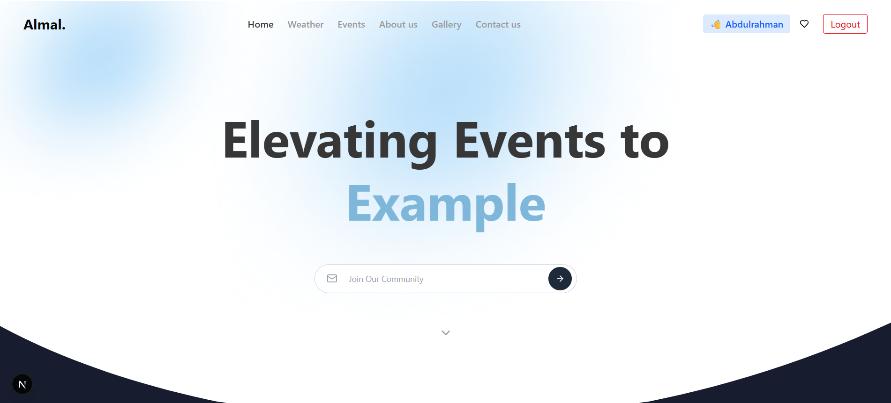
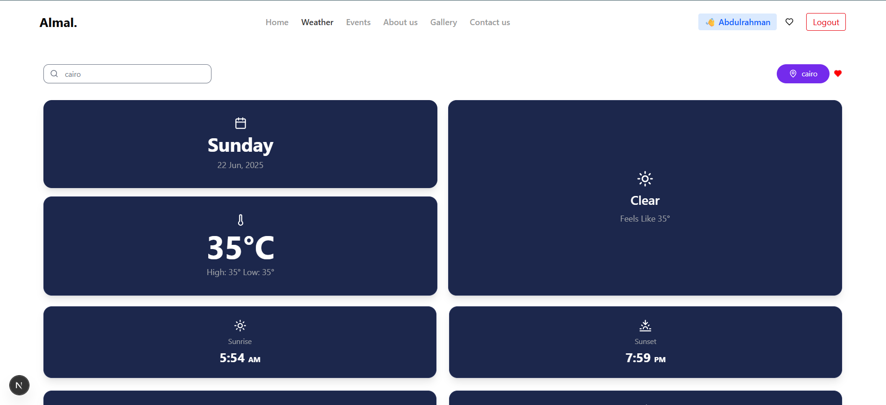

A full-stack weather application built using Next.js App Router, with features like:

🌍 Real-time weather data

❤️ Add/remove favorite cities

🔐 JWT authentication with HttpOnly cookies

☁️ Dynamic icons and summaries

☀️ Sunrise/sunset info

🧠 Protected routes and persistent user sessions


Features
✅ Authentication
Built with JWT + HttpOnly Cookies

Secure login and signup using bcrypt and custom API routes

token is stored in cookies, decoded server-side using jsonwebtoken

🏙️ Weather Data
Fetched using OpenWeatherMap API

Dynamic based on:

Default location (Cairo)

Searched city (Enter key)

Auto-detect location via browser geolocation

Temperature toggle (°C / °F)

Shows:

Current temp, feels like, high, low

Wind speed, humidity, condition

Sunrise and sunset time

❤️ Favorites
Protected API route to add/remove cities from user’s favorites

Stored inside MongoDB Atlas inside users collection

List rendered on /favorites page (protected)

Add/remove city with one click using a ❤️ icon


src/
├── app/
│   ├── favorites/               ← Favorites page (protected)
│   ├── api/
│   │   ├── auth/                ← login, register, me
│   │   └── favorites/           ← add/remove/get
├── components/
│   ├── WeatherCard.tsx         ← Weather UI component
│   ├── FavoritesList.tsx       ← Display user favorites
├── hooks/
│   ├── useWeather.ts           ← Weather API logic
│   └── useAuthGuard.ts         ← Protect routes
├── lib/
│   └── mongodb.ts              ← MongoDB connection
├── models/
│   └── User.ts                 ← Mongoose User schema

#Home


#Home


#weather



This is a [Next.js](https://nextjs.org) project bootstrapped with [`create-next-app`](https://nextjs.org/docs/app/api-reference/cli/create-next-app).

## Getting Started

First, run the development server:

```bash
npm run dev
# or
yarn dev
# or
pnpm dev
# or
bun dev
```

Open [http://localhost:3000](http://localhost:3000) with your browser to see the result.

You can start editing the page by modifying `app/page.tsx`. The page auto-updates as you edit the file.

This project uses [`next/font`](https://nextjs.org/docs/app/building-your-application/optimizing/fonts) to automatically optimize and load [Geist](https://vercel.com/font), a new font family for Vercel.

## Learn More

To learn more about Next.js, take a look at the following resources:

- [Next.js Documentation](https://nextjs.org/docs) - learn about Next.js features and API.
- [Learn Next.js](https://nextjs.org/learn) - an interactive Next.js tutorial.

You can check out [the Next.js GitHub repository](https://github.com/vercel/next.js) - your feedback and contributions are welcome!

## Deploy on Vercel

The easiest way to deploy your Next.js app is to use the [Vercel Platform](https://vercel.com/new?utm_medium=default-template&filter=next.js&utm_source=create-next-app&utm_campaign=create-next-app-readme) from the creators of Next.js.

Check out our [Next.js deployment documentation](https://nextjs.org/docs/app/building-your-application/deploying) for more details.
